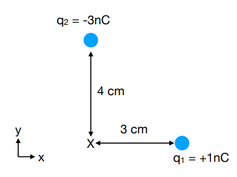
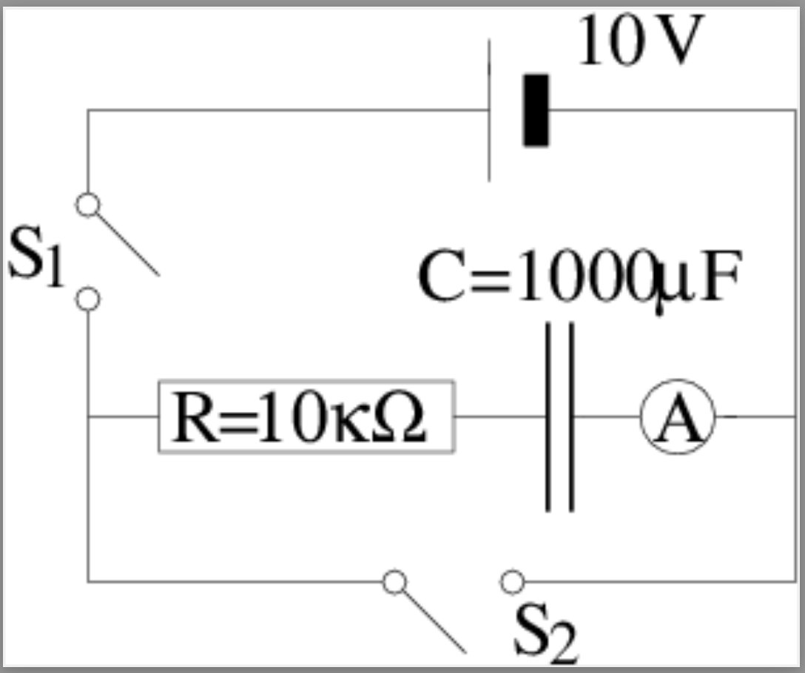

# Question 1

For the arrangement of charges shown in the diagram, calculate:

{fig-alt="A diagram of two charges." fig-align="center"}

a) the Coulomb force between the two charges,
b) the electric field at point X,
c) the force on a 3rd charge of -2nC placed at point X.

# Question 2

Draw the electric field lines of a system consisting of:

a) two charges of equal magnitude and the same sign,
b) two charges of equal magnitude but the opposite sign, and
c) two charges, one with charge -5 C and one with charge +3C.

# Question 3

Look at the circuit below. The switch S~1~ is closed and the capacitor is uncharged.

{width=7cm fig_alt="A circuit diagram." fig-align="center"}

a) Calculate the current measured in the ammeter immediately after switch S~1~ is closed.
b) Calculate the current measured in the ammeter 10 s after closing switch S~1~.
c) Calculate the current measured in the ammeter 5 minutes after closing switch S~1~.
d) After 10 minutes, the switch S~1~ is open and switch S~2~ is closed. Calculate the current in the ammeter immediatedly after S~2~ is closed.
e) Calculate the current in the ammeter 10 s after S~2~ is closed.
f) Calculate the current in the ammeter 5 minutes after S~2~ is closed.
