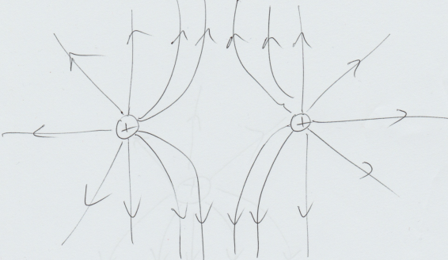
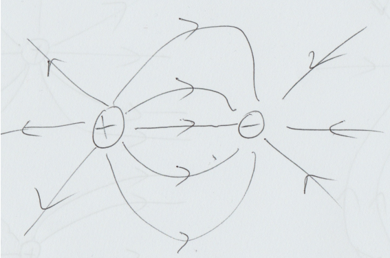
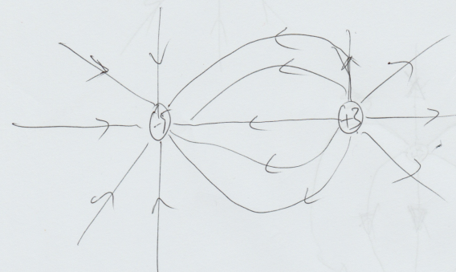

# Question 1

For the arrangement of charges shown in the diagram, calculate:

{fig-alt="A diagram of two charges." fig-align="center"}

a) the Coulomb force between the two charges,

::: {.callout-caution collapse="true"}
## Solution

The distance between the two charges can be found using Pythagoras:
$$
r = \sqrt{3^2+4^2} = 5\,\text{cm}.
$$
We then apply Coulomb's Law:
$$
F = \frac{q_1 q_2}{4 \pi \epsilon_0 r^2}
$$
$$
F = \frac{1 \times 10^{-9} \cdot -3 \times 10^{-9} }{4 \pi \cdot 8.85 \times 10^{-12} \cdot 0.05^2}
$$
$$
F = -1.1 \times 10^{-5}\,\text{N}. 
$$
The answer is negative so this is an attractive force. This makes sense: we know that charges of opposite sign should attract each other.
:::

b) the electric field at point X,

::: {.callout-caution collapse="true"}
## Solution

Remember, the electric field is a VECTOR quantity and must have both magnitude and direction. We need to find the electric field at X due to each charge and then we can sum these two vectors to get the resultant. For each charge, we use the equation:
$$
E = \frac{q_1}{4 \pi \epsilon_0 r^2}
$$
to find the field strength.

For charge q~1~:
$$
E_1 = \frac{1\times10^{-9}}{4 \pi \cdot 8.85 \times 10^{-12} \cdot 0.03^2} = 10^4\,\text{Vm}^{-1}
$$
and the direction of the field is in the negative x direction because electric field lines point away from positive charges. We can write this as:
$$
\vec{E_1} = -10^4 \vec{i} \,\text{Vm}^{-1}
$$
where $\vec{i}$ is the unit vector in the x direction.

For charge q~2~:
$$
E_2 = \frac{-3\times10^{-9}}{4 \pi \cdot 8.85 \times 10^{-12} \cdot 0.04^2} = -1.69\times 10^4\,\text{Vm}^{-1}.
$$
The negative sign indicates the field at X points TOWARD the charge q~2~ not away from it, so the field points in the positive y direction. The vector is therefore:
$$
\vec{E_2} = 1.69\times10^4 \vec{j} \,\text{Vm}^{-1}
$$
where $\vec{j}$ is the unit vector in the y direction.

To find the total electric field at X we sum these two contributions:
$$
\vec{E} = \vec{E_1} + \vec{E_2} = -10^4 \vec{i} + 1.69 \times 10^4 \vec{j} \text{Vm}^{-1}.
$$
It is also acceptable to give the vector in terms of its magnitude and direction, $|E| = 1.96 \times 10^4$\,Vm$^{-1}$, with an angle of $59^{\circ}$ above the negative $x$-axis.
:::

c) the force on a 3rd charge of -2nC placed at point X.

::: {.callout-caution collapse="true"}
## Solution
To find the force on the third charge, we use the equation $\vec{F} = q\vec{E}$ and so
$$
\vec{F} = 2\times10^{-5} \vec{i} - 3.38\times10^{-5}\vec{j}\,\text{N}
$$
:::

# Question 2

Draw the electric field lines of a system consisting of:

a) two charges of equal magnitude and the same sign,

::: {.callout-caution collapse="true"}
## Solution
The key point for all these is that field lines must flow away from positive charges and towards negative charges. The answer below assumes both charges are positive.

{fig-alt="Field lines of two similar charges." fig-align="center"}
:::

b) two charges of equal magnitude but the opposite sign, and

::: {.callout-caution collapse="true"}
## Solution
{fig-alt="Field lines of two opposite charges." fig-align="center"}
:::

c) two charges, one with charge -5 C and one with charge +3C.

::: {.callout-caution collapse="true"}
## Solution
{fig-alt="Field lines of two unequal charges." fig-align="center"}

The important point for this final case is that their must be a greater density of field lines around the bigger charge.
:::

# Question 3

Look at the circuit below. The switch S~1~ is closed and the capacitor is uncharged.

{width=7cm fig_alt="A circuit diagram." fig-align="center"}

a) Calculate the current measured in the ammeter immediately after switch S~1~ is closed.

::: {.callout-caution collapse="true"}
## Solution

At the moment of closing the 10~$V$ potential difference is all of a sudden over the RC-system. 
$\Delta V$ over the capacitor is still zero, so the whole 10~$V$ drop over the resistor.
Hence,
$$
I=\frac{V}{R}=\frac{10V}{10\cdot 10^3 \Omega}=1~mA
$$
:::

b) Calculate the current measured in the ammeter 10 s after closing switch S~1~.

::: {.callout-caution collapse="true"}
## Solution
When charging a capacitor, the current changes as:
$$ I(t) = I(0) e^{-\frac{t}{RC}} = 1mA \cdot e^{-\frac{10s}{10^4\Omega \cdot 10^-3 F}} = 0.37 mA.
$$
  
Alternatively, you can calculate the voltage over the resistor after 10s and obtain the current that way.
The voltage over the capacitor is given by the charging up equation. Putting in the numbers
$$
V_C=V_0\left(1-e^{-\frac{t}{RC}}\right)=10\left(1-e^{-\frac{10s}{10s}}\right)=6.3~V
$$
Thus there is a drop of $10.0V-6.3V=3.7~V$ over the resistor. Using Ohm's Law $I=V\Big/R=3.7 V \Big/ 10\cdot 10^3 \Omega=0.37~mA$.
:::

c) Calculate the current measured in the ammeter 5 minutes after closing switch S~1~.

::: {.callout-caution collapse="true"}
## Solution

5 minutes are so long compared to the $RC=10~s$ time interval that the capacitor is essentially charged up to $10~V$. So there is no potential difference across the resistor and thus the current is zero.

:::

d) After 10 minutes, the switch S~1 is open and switch S~2~ is closed. Calculate the current in the ammeter immediatedly after S~2~ is closed.

::: {.callout-caution collapse="true"}
## Solution

Now the voltage source is no longer connected, the current now comes from the discharging of the capacitor.
At the moment of closing the voltage over the capacitor is still 10~$V$. Thus using Ohm's law we find again 1~$mA$.

:::

e) Calculate the current in the ammeter 10 s after S~2~ is closed.
 
::: {.callout-caution collapse="true"}
## Solution

Also when discharging the capacitor, the current changes exponentially according to:
$$
I(t) = I(0) e^{-\frac{t}{RC}} = 1mA \cdot e^{-\frac{10s}{10^4\Omega \cdot 10^-3 F}} = 0.37 mA.
$$

 As the voltage source is no longer connected the voltage over the capacitor is the same as the voltage over the resistor (resistance in the ammeter is negligible).
:::

f) Calculate the current in the ammeter 5 minutes after S~2~ is closed.

::: {.callout-caution collapse="true"}
## Solution
After such a long time the discharging is essentially complete. So there is no voltage drop over the resistor and hence no current is flowing.
:::
