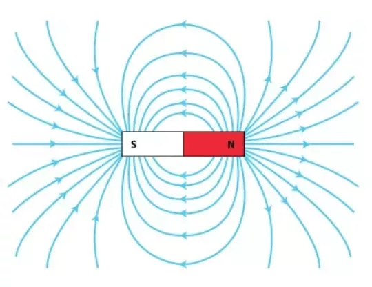

# Question 1

a) What is the source of the magnetic field?

::: {.callout-caution collapse="true"}
## Solution

Moving charges.
:::

b) Why do magnetic field lines only form closed loops?

::: {.callout-caution collapse="true"}
## Solution

Because there is no magnetic monopole, field lines cannot have a start or finish.  They must therefore form closed loops.
:::

c) Draw the magnetic field of a bar magnet. Where is the field strongest? Where is the field weakest?

::: {.callout-caution collapse="true"}
## Solution

See the figure below.  The field is strongest where the field lines are closest together, near the ends of the bar, and weakest where the field lines are far apart, in between the poles and away from the bar. 

{width=7cm fig-align=center}

:::

# Question 2

 A wire is fixed horizontally and has a current of 100 A running through from left to right. A second wire is placed parallel to it and 10 cm lower. The second wire weighs 100$\,\text{g/m}$. How much current needs to be flowing through the 
second wire and in which direction in order to keep it afloat?

::: {.callout-caution collapse="true"}
## Solution

The Lorentz force between two wires is given by:
$$
F=\frac{\mu_0}{2\pi}\frac{I_1 I_2}{d}L
$$

In order to stay afloat this must equal gravity and the wires need to attract each other. So the direction of the currents in both wires is the same. To calculate the current required, equate the weight of the wire to the Lorentz force between the two wires (note that $\rho$ is the mass per unit length, not the density here!):

$$
\begin{aligned}
mg&= L\rho g=\frac{\mu_0}{2\pi}\frac{I_1 I_2}{d}L \\
\Rightarrow I_2&= \frac{2 \pi}{\mu_0}\frac{\rho g d}{I_1}= \frac{2 \pi}{4\pi \times 10^{-7}}\frac{0.1\cdot10\cdot 0.1}{100}=5000~A
 \end{aligned}
$$

:::

# Question 3

A proton, emitted from the sun, is approaching Earth at 1$\times10^{6}\,\text{m/s}$ perpendicular to the Earth's magnetic field ($0.05\,$mT). The sun is to the left of the Earth as shown in the figure below.

{width=7cm fig-align=center}

a) Describe the orbit of the proton. In which direction does it perform circular movement?

::: {.callout-caution collapse="true"}
## Solution

The proton experiences a Lorentz force due to the Earth's magnetic field, and therefore undergoes circular motion around the field lines.
	
When viewed from above the geographic North pole, the protons move in a clockwise orbit. (Note that the geographic N pole is the magnetic S pole, so viewed from this position the field points towards from the observer.)

:::

b) Calculate the radius of the proton's orbit.

::: {.callout-caution collapse="true"}
## Solution

Equating the Lorentz force to the centripetal force, we have :
$$
\frac{mv^2}{r} = qvB.
$$

Hence 
$$
r = \frac{mv}{qB} = \frac{1.67 \times 10^{-27} \cdot 1 \times 10^6}{1.6 \times 10^{-19} \cdot 5 \times 10^{-5}} = 209 \text{m}
$$

:::
