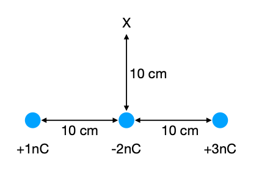
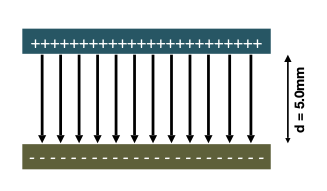

## Question 1

A charge of +36μC is at a point A. At a point B located 8.0 m away, there is a second charge of −16μC. Calculate the electric field at each of the following points:

a.) a point located 6m away from A and 2m away from B,

::: {.callout-caution collapse="true"}
## Solution

The electric field at a point r away from a charge of Q is given by:
$$
\vec{E} = \frac{Q}{4\pi\epsilon_0 r} \vec{\hat{r}} 
$$
where $\vec{\hat{r}}$ is the unit vector from the charge to the point in question. Using this equation we have:
$$
E_A = \frac{36\times10^{-6}}{4\pi\times 8.85\times10^{-12}\times6^2} = 8.99\times10^3\,\text{N/C}
$$
What about the direction? The unit vector points from A to B, so the electric field also points in the direction A to B. For the second field:
$$
E_B = \frac{-16\times10^{-6}}{4\pi\times 8.85\times10^{-12}\times 2^2} = -3.60\times10^4\,\text{N/C.}
$$
This time the unit vector is pointing from B to A, but because the charge is negative the field points from A to B. Summing the two fields gives a total electric field of $E = E_A + E_B = 4.50\times10^3$\,N/C in the direction A to B.
::: 

b.) a point located 10m away from A and 2m away from B,

::: {.callout-caution collapse="true"}
## Solution

This time, we have:
$$
E_A = \frac{36\times10^{-6}}{4\pi\times 8.85\times10^{-12}\times10^2} = 3.24\times10^3\,\text{N/C}
$$
with the field pointing in the direction A to B, and:
$$
E_A = \frac{-16\times10^{-6}}{4\pi\times 8.85\times10^{-12}\times2^2} = -3.60\times10^4\,\text{N/C}
$$
with the unit vector pointing away from B, so the electric field points toward both A and B. The total electric field is thus $E = 3.24\times10^3 - 3.60\times10^4 = -3.28\times10^4$\,N/C. The negative sign means the direction is towards both A and B.
:::

Remember that the electric field is a *vector* quantity -- it must have both magnitude and direction.

## Question 2

Three charges are arranged in a line as shown in the figure below.

{fig-alt="A diagram showing three charges in a line" fig-align="center"}

Calculate:

i. The total force acting on the charge in the middle (-2nC).

::: {.callout-caution collapse="true"}
## Solution
We apply Coulomb's Law to each charge individually and then add up the forces to find the resultant force. For the 1nC and -2nC charge (remember to convert the distances into metres!):
$$
F_{12} = \frac{q_1q_2}{4\pi\epsilon_0 r^2} = \frac{1\times10^{-9}\times-2\times10^{-9}}{4\pi \times 8.85\times10^{-12} \times 0.1^2} = -1.80\times10^{-6}\,\text{N}
$$
with the negative sign indicating the force is attractive (i.e. it is pulling the -2nC towards the left in the diagram).

For the -2nC and +3nC charge:
$$
F_{23} = \frac{q_2q_3}{4\pi\epsilon_0 r^2} = \frac{-2\times10^{-9}\times3\times10^{-9}}{4\pi \times 8.85\times10^{-12} \times 0.1^2} = -5.40\times10^{-6}\,\text{N}.
$$
Again, this is an attractive force but it is acting in the opposite direction to the previous one (i.e. this forces acts towards the right in the diagram). Summing these two, with the rightwards direction being positive:
$$
F_\mathrm{tot} = F_{12} + F_{23} = -1.80\times10^{-6} + 5.40\times10^{-6} = 3.6\times10^{-6}\,\text{N.}
$$

:::

ii. The electric potential energy U of the three charges

::: {.callout-caution collapse="true"}
## Solution
The total electric potential energy is the sum of the electric potential energy for each pair of charges, where
$$
U = \frac{q_1q_2}{4\pi\epsilon_0 r}
$$
is the potential energy for any pair of charges. Thus the total potential energy is:
$$
\begin{align}
U_\mathrm{tot} &= U_{12} + U_{23} + U_{13} \\
&= \frac{q_1q_2}{4\pi\epsilon_0 r_{12}} + \frac{q_2q_3}{4\pi\epsilon_0 r_{23}} + \frac{q_1q_3}{4\pi\epsilon_0 r_{13}} \\
& = \frac{1\times10^{-9}\times-2\times10^{-9}}{4\pi \times 8.85\times10^{-12} \times 0.1} + \frac{-2\times10^{-9}\times3\times10^{-9}}{4\pi \times 8.85\times10^{-12} \times 0.1} + \frac{1\times10^{-9}\times3\times10^{-9}}{4\pi \times 8.85\times10^{-12} \times 0.2} \\
& = -5.80 \times 10^{-7}\,\mathrm{J.}
\end{align}
$$

:::

iii. The electric potential at point X

::: {.callout-caution collapse="true"}
## Solution
Just like the electric potential energy, the electric potential is the sum of the individual potentials from each of the charges and the potential from one charge is given by:
$$
V(r) = \frac{1}{4\pi\epsilon_0}\frac{q}{r}
$$
The total potential at X is therefore (using Pythagoras to find the distance for charges 1 and 3):
$$
V_\mathrm{tot} = \frac{10^{-9}}{4\pi\epsilon_0\times\sqrt{0.02}} + \frac{-2\times10^{-9}}{4\pi\epsilon_0\times0.1} + \frac{3\times10^{-9}}{4\pi\epsilon_0\times\sqrt{0.02}} = 74.6\,\mathrm{J/C}
$$

:::

iv. The electric field at point X

::: {.callout-caution collapse="true"}
## Solution
The electric field is a vector quantity, so we need a magnitude and direction for the field associated with each individual charge. We can then sum up these vector fields individually to get the net field. It is helpful to define a set of axes at this point: the x-direction lies in the line of the three charges and is positive towards the right. The y-direction is perpendicualr to this with positive being upwards toward point X. The unit vectors in the x- and y-directions are $\vec{i}$ and $\vec{j}$ respectively.

The magnitude of an electric field is given by:
$$
E = \frac{1}{4\pi\epsilon_0}\frac{q}{r^2}
$$
and the direction acts on a line joining the charge to the point we are interested in. If the charge is positive, the direction is away from the charge.

For the 1nC charge, the E-field magnitude is:
$$
E_1  = \frac{10^{-9}}{4\pi\epsilon_0\times0.02}
$$
and it acts in the direction $\frac{1}{\sqrt{2}}(\vec{i}+\vec{j})$ (the factor ensure this is a unit vector) giving:
$$
\vec{E_1} = 318 (\vec{i}+\vec{j})\,\mathrm{N/C}.
$$
For the -2nC charge the electric field acts in the negative $\vec{j}$ direction, so:
$$
\vec{E_2} = \frac{-2\times 10^{-9}}{4\pi\epsilon_0\times0.1^2} \vec{j} = - 1800 \vec{j}\,\mathrm{N/C}.
$$
And finally for the last charge we have:
$$
\vec{E_3} = \frac{3\times10^{-9}}{4\pi\epsilon_0\times0.02}\times\frac{1}{\sqrt{2}}(-\vec{i}+\vec{j}) = 954 (-\vec{i}+\vec{j})
$$
Adding these together gives the resultant electric field:
$$
\vec{E_\mathrm{tot}} = -636 \vec{i} - 528 \vec{j}\, \mathrm{N/C.}
$$
:::

v. The force that a charge of -2nC would experience if it was placed at point X.

::: {.callout-caution collapse="true"}
## Solution

The net force can be found by simply multiplying the charge by the electric field found in part iv., i.e.
$$
\vec{F}= q\vec{E_\mathrm{tot}} = -2\times10^{-9} \times (-636 \vec{i} - 528 \vec{j}) = 1.27\times10^{-6}\vec{i} + 1.06\times10^{-6}\vec{j}\ \mathrm{N.}
$$
:::

## Question 3

On the surface of a sphere with a radius of 10 cm 10000 electrons are evenly spread out.

a.)	Calculate the electric field at a point 50 cm away from the center of the sphere.

::: {.callout-caution collapse="true"}
## Solution
This question requires the use of Gauss' Law. We expect the system to have spherical symmetry, so we use a spherical surface centred on the middle of the sphere. The E-field is then perpendicular to the spherical surface. Gauss' Law states:

$$
\Phi = EA = \frac{Q}{\epsilon_0}
$$
where $Q=-1.6\times10^{-19}\times10^5$ is the total charge enclosed, and $A = 4\pi r^2$ is the area of the Gaussian surface. Therefore
$$
E = \frac{-1.6\times10^{-19}\times10^5}{4\pi \times (0.5)^2 \times 8.85\times10^{-12}} = -5.75 \times 10^{-5}\,\text{V/m.}
$$
The minus sign indicates the field is pointing inward from the surface, towards the centre of the sphere.
:::

b.)	Calculate the electric field at a point 5 cm away from the center of the sphere.
 
::: {.callout-caution collapse="true"}
## Solution
For a surface placed at 5cm from the sphere's centre, there is NO charge enclosed inside the surface. Gauss' Law therefore states that the electric field must be zero, $E = 0$.

:::

c.)  This sphere is placed inside a hollow sphere with a radius of 20 cm. Uniformly spread out over the surface of this sphere are 20000 protons. Calculate the electric field at a point 50 cm away from the center of the sphere. 

::: {.callout-caution collapse="true"}
## Solution

As with part a.) we only need to know about the total charge within the Gaussian surface. The total charge is $Q = (20000 - 10000)\times1.6\times 10^{-19} = 1.6\times10^{-14}$. Therefore:
$$
E = \frac{Q}{A\epsilon_0} = \frac{1.6\times10^{-19}\times10^5}{4\pi \times (0.5)^2 \times 8.85\times10^{-12}} = 5.75 \times 10^{-5}\,\text{V/m.}
$$
Here the value of E is positive, so the field is pointing away from the centre of the sphere.
:::

## Question 4

In a vacuum, a proton ($m_p = 1.673 \times 10^{−27}\,$kg) is travelling at $1 \times 10^6\,$m/s from very, very far away towards another proton that is fixed at its position. The electrostatic potential energy U between two point charges is given by:
$$
U = \frac{1}{4\pi\epsilon_0}\frac{q_1q_2}{r}
$$
 
Calculate how close the protons approach each other. 

Hint: The question might look very difficult at first, but it is very similar to throwing a ball up in the air. You convert kinetic energy into potential energy. At the moment where the distance is the closest, all kinetic energy is converted into potential energy.

::: {.callout-caution collapse="true"}
## Solution

Initially, all the energy in the system is in the form of kinetic energy for the moving proton. At the point of closest approach all the kinetic energy will have been converted to potential energy, so:
$$
\begin{align}
E_\mathrm{kin} &= U \\
\frac{1}{2}mv^2 &= \frac{1}{4\pi\epsilon_0}\frac{q_1q_2}{r} \\
\Rightarrow r &= \frac{2}{4\pi\epsilon_0}\frac{q_1q_2}{mv^2} = 2.75\times10^{-13}\,\mathrm{m}.
\end{align}
$$
This isn't quite enough to get the two to collide -- nuclei are typical of the order of $10^{-15}\,$m.

:::

## Question 5

Two parallel plates are placed 5mm apart from one another to form a capacitor. A voltage of 20 V is applied across the plates creating an electric field as shown in the diagram below.

{fig-align="center" fig-alt="Two plates forming a capacitor with an electric field between them"}

a.) Calculate the strength of the electric field inside the capacitor.

:::{.callout-caution collapse="true"}
## Solution

The electric field strength for parallel plates is given by $E=V/d$. 20 V are applied across the plate and the separation is $5\times10^{-3}\,$mm. Thus:
$$
E = \frac{V}{d} = \frac{20}{5\times10^{-3}} = 4000\,\mathrm{V/m}.
$$
Remember that V/m is one of the possible units for electric field strength (N/C is the other) and it can help you to remember this formula.
:::

b.) What is the electric field *outside* the capacitor? You do not need to calculate this -- just explain it!

:::{.callout-caution collapse="true"}
## Solution

The field is zero. Place a cylindrical Gaussian across the two plates of the capacitor. The enclosed net charge must be zero, so the electric flux must also be zero. Considering the symmetry of the system, the field must therefore be zero.
:::

c.) A proton is place in the centre of the two plates. It is then moved from left to right by 2cm. What is the difference in potential energy?

:::{.callout-caution collapse="true"}
## Solution

The proton is being moved perpendicular to the field lines, so no work is being done. There is therefore no difference in potential energy.

:::

d.) The proton is now moved upward by 0.1 mm. Calculate the change in potential energy.

:::{.callout-caution collapse="true"}
## Solution

$$
\Delta U = W = F.d = qEd = 1.6\times10^{-19}\times 4000 \times 0.1\times 10^{-3} = 6.4\times10^{-20} J
$$
The value is positive because we are doing work against the electric field -- like pushing something up a hill.
:::

e.) The proton is now moved downward by 0.1 mm. What is the change in potential energy?

:::{.callout-caution collapse="true"}
## Solution

The work done is now $-6.4\times10^{-20} J$. The minus sign indicates that the field is now doing the work for us.

:::

