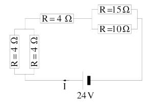
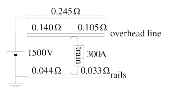
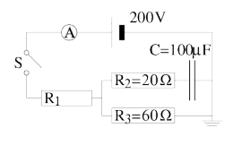

## Question 1

For the circuit shown below, calculate:

a.) the total resistance and
b.) current I.

{fig-align="center" fig-alt="A circuit diagram composed of resistors"}

## Question 2

A $3\,\mu F$ capacitor and a $5\,\mu F$ capacitor are placed in parallel with each other. They are also in parallel to a 12 V source. Calculate the charge on each capacitor.

## Question 3

A $4\,\mu F$ capacitor and a $6\,\mu F$ capacitor are placed in series with each other. They are also in series with a 20 V source. Calculate the charge on each capacitor and the potential difference across each capacitor.

## Question 4

An electric train takes its power form an overhead line, which consists of a series of copper wires with a cross-sectional area of $100\,mm^2$ held at a potential of 1500 V. The circuit is shown below. The current runs through the overhead line, through the train and then back through the rails. Note that the resistance between the voltage sources and the train, as well as the resistance between the train and ground, depend on the position of the train. At moderate velocity there is a current of 300 A running through the train.

{fig-align="center" fig-alt="A circuit diagram for an electric train and rail system."}

a.) Calculate the resistance of an overhead line that is 1.5 km long. The resistivity of copper is $17.2\,n\Omega m$.

b.) Calculate the voltage drop over the train when it is at the position indicated in the figure.

c.) Calculate the power that is lost:

i) in the overhead line,
ii) in the rails, and
iii) in the engine of the train.

d.) What fraction of the power is actually used in the engine of the train?

## Question 5

In the circuit below, the switch S is closed. After a long time, the current through the ammeter is 2 A.

{fig-align="center" fig-alt="A circuit diagram with resistors and a capacitor."}

a.) Calculate the resistance of resistor R~1~.

b.) Calculate the voltage across the capacitor.

